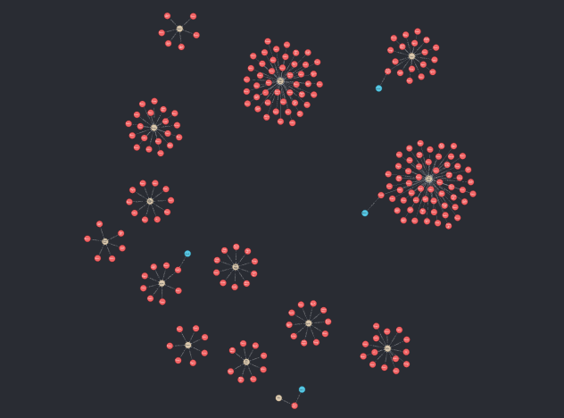

# LinkedOut

## Introduction

LinkedOut is a user-friendly platform tailored to seasonal workers on the hunt for job opportunities.

This platform offers a variety of essential features, including user profile management, job listing services, intelligent job recommendations, streamlined recruitment processes, transparent review and rating systems, and multilingual support (initially in French and English).

## Microservices

One of the main goal of this project was to learn how to create and manage a microservice architecture.

Microservices architecture offers independent scaling of components, allowing each part to adapt to its resource needs and load patterns.
This promotes flexibility and agility by decoupling different parts of the system, facilitating faster iteration and feature releases Furthermore, microservices enable the use of diverse technologies and programming languages within a single application. In our case we only use kotlin but we could have used different languages for each service.
Failures are easier to handle since services are isolated, reducing the risk of cascading failures across the system. They enhance resilience and availability through redundancy and distributed architectures.
Microservices also facilitate easier maintenance and evolution of complex systems due to well-defined scopes and responsibilities.
Lastly, they support DevOps practices such as continuous integration, continuous delivery, and automation, fostering a more efficient development and deployment process.
It was a bit hard to get started but once we understood the basics, it was really easy to work with microservices since it is very repetitive.

### API Gateway

The API Gateway serves as the entry point for client requests into the microservices architecture, acting as a central interface for managing and routing HTTP requests. It plays a pivotal role in handling communication between clients and the underlying microservices.

In handling HTTP requests, the API Gateway acts as a reverse proxy, receiving incoming requests from clients and forwarding them to the appropriate microservices based on predefined routing rules. It abstracts the complexity of the underlying microservices architecture, presenting clients with a unified interface while allowing backend services to evolve independently.

Moreover, the API Gateway can leverage NATS (a lightweight and high-performance messaging system) to facilitate inter-service communication. When a client request requires interaction with multiple microservices, the API Gateway can publish messages to NATS topics, allowing interested microservices to subscribe and respond accordingly. This asynchronous messaging pattern enhances scalability and resilience within the microservices ecosystem. For example if a microservice is down, the message will be stored in the NATS server and the microservice will be able to process it once it is back up. That process is called event sourcing.

At the beginning of the project we decided to use the OpenAPI specification to define the API Gateway's RESTful API.
This allowed us to define the API's structure, enabling us to have a common view of what the backend will have to look like. Looking back, it was a good decision since it allowed us to have a clear view of what we had to do and it also allowed us to write a mock server to test the front end using json server. That allowed us to work on the front end and the back end at the same time without having to wait for the other to be done.
To explore the OpenAPI documentation for the API Gateway and associated services, you can access the following link: [API Gateway OpenAPI Documentation](docs/openapi/api_gateway.yml)

### NATS

NATS is a lightweight and high-performance messaging system that facilitates communication between microservices within a distributed architecture. It serves as a central messaging backbone, enabling efficient and reliable message delivery across different components of the system.

In essence, NATS functions as a publish-subscribe messaging system, where producers publish messages to subjects (topics), and consumers subscribe to specific subjects to receive messages. This decouples the producers and consumers, allowing for asynchronous communication and reducing dependencies between microservices.

Within a microservices architecture, NATS is used to enable inter-service communication. When one microservice needs to communicate with another, it can publish messages to relevant NATS subjects, indicating the intent or action required. Subsequently, other microservices that are interested in the message content can subscribe to the appropriate subjects and react accordingly.

To optimize message transmission and ensure compatibility between microservices, we chose Protocol Buffers (protobuf) to define the structure and serialization format of messages exchanged via NATS. Protobuf allows for the definition of message schemas in a language-neutral format, facilitating communication between services implemented in different programming languages. We splitted the messages into smaller, granular units based on business logic and functional requirements. We have [models](./backend/protobuf/src/main/proto/models/) which represent basic object like experience, jobOffer, profile etc. We also have [dtos](./backend/protobuf/src/main/proto/dto/) which are data transfer object. Then for each service we have a [service](./backend/protobuf/src/main/proto/services/) which represent the service's api. We then have a request and a response for each function of the service [request](./backend/protobuf/src/main/proto/request.proto) [response](./backend/protobuf/src/main/proto/response.proto).

By using protobuf, messages can be efficiently serialized and deserialized, reducing message size and network overhead. Additionally, protobuf schemas help in maintaining compatibility between different versions of microservices by allowing for backward and forward compatibility through the addition or modification of message fields.

To further enhance scalability and performance, messages are typically split into smaller, granular units based on business logic and functional requirements. This practice helps in reducing message complexity, improving parallel processing, and enabling fine-grained control over message routing and processing within the microservices architecture.

Overall, NATS, in conjunction with protobuf, plays a crucial role in facilitating seamless communication and interaction between microservices, enabling the development of scalable, resilient, and loosely coupled distributed systems.

### Keycloak authentication

Keycloak serves as our identity and access management solution, enabling user authentication and authorization within our microservices architecture.

The authentication flow begins when a user attempts to access protected resources within our system. The client application forwards the user's credentials (e.g., username and password) to the Keycloak authentication server for verification.

Once Keycloak verifies the user's credentials, it issues a JSON Web Token (JWT) containing authentication and authorization information. This JWT is then sent back to the client application.

Within our microservices architecture, we have implemented a centralized authentication mechanism using Keycloak and the API Gateway. The API Gateway intercepts incoming requests from clients and checks the JWT provided in the request headers against the Keycloak server to ensure the user's authentication and authorization status. If the JWT is valid, the API Gateway forwards the request to the appropriate microservice for further processing.
We decided to only check the token in the gateway and not in each microservice to avoid having to check the token in each microservice. We could have do a zero trust architecture where each microservice would check the token but we decided to go with the centralized approach.

We use a custom keycloak config stored in [linked_realm](./config/keycloak/linkedout_realm.json) which contains the roles and the clients we use. This config is then imported in the keycloak server and saves us a lot of time since we don't have to create the roles and the clients manually.

### Profile Service

The Profile Service is responsible for managing user profiles within the LinkedOut platform. It handles the creation, retrieval, and modification of user profiles, as well as the management of user experiences, evaluation, and availability. This service also has to contact the recommendation service whenever a new user is created to store a neo4j node with his uuid to then later recommend special job offers for this user.

### Job Service

The Job Service is responsible for managing job offers within the LinkedOut platform. It does not handle the creating of jobs and jobOffers since it was specified the "employer service" was responsible for that. It handles the retrieval of job offers, jobs and jobCategories, the creation of job applications, and the management of job applications and job offers.
This service also has to contact the rsecommendation service to retrieve custom job offers for a user. We used flyway migration to keep the database up to date and store the constant informations like job categories and jobs as well as some jobOffers since we don't have any routes to create those.

### Message Service

- Explain the role of the message services

### Notification Service

- Explain the role of the notification services

### Recommendation Service

The Recommendation Service is responsible for providing personalized job recommendations to users based on their profiles and experiences. It leverages a graph database (Neo4j) to store and manage user profiles, experiences, and job offers, and uses graph-based algorithms to generate recommendations.

Like in the job service we populate the database with the job categories, job offers and jobs. To do so we use a [cypher script](./backend/recommendation/) and a neo4j plugin named APOC (Awesome Procedures on Cypher), which provides a set of procedures and functions to enhance the capabilities of Neo4j.

In the picture above you can see the graph database after initialization. In red you see each job nodes, in yellow each job category and in blue each job offer nodes.

When a new user profile is created, the Recommendation Service stores the user's profile as a new node in the Neo4j graph database containing only it's id. Same thing when a new experience is created. We create a new node with the experience id and link it to both a user node and a job. By doing so we have a graph of users, experiences, jobs and job offers. We then use the neo4j driver to retrieve the recommendations. We use the graph database to find the shortest path between the user and the job offer. We then return a list of job offers ids. This list of job offers ids is then used to retrieve the job offers from the job service. If there is no job offers to return the job service will return all the job offers in the database.

In the picture above you can see the graph database after we created a new user (the green node) with multiple experiences (the pink nodes).

- we wanted to try graph databases since we never tried it before
- explain when and how we create nodes
- explain how the recommendation works
- screenshot of the database nodes

## Kubernetes deployment

We chose to deploy our microservices architecture on a Kubernetes cluster to take advantage of its container orchestration capabilities, scalability, and resilience and to improve our understanding of this tool.

- talk about how each micro service can be scaled
- talk about how the application can be deployed on any kubernetes cluster
- talk about the charts

## Room for Improvement
