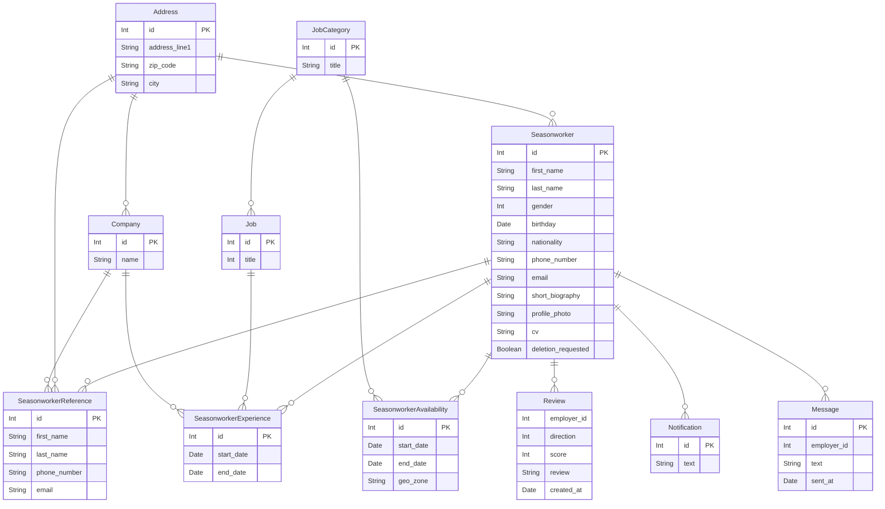

# Analysis Document - LinkedOut

LinkedOut is a user-friendly platform tailored to seasonal workers on the hunt for job opportunities.

This platform offers a variety of essential features, including user profile management, job listing services, intelligent job recommendations, streamlined recruitment processes, transparent review and rating systems, and multilingual support (initially in French and English).

## Terminology

### Actors

- User: A person using the platform that is not yet registered.
- Seasonworker: A person looking for a job for a season.
- Employer: A person looking for a seasonworker.
- Administrator: A person managing the platform.

### Glossary

- Reference: A person who can recommend a seasonworker.

## User stories

### Authentication and account

- As a user, I want to create a seasonal worker account.
- As a user, I want to be able to log in.
- As a seasonal worker, I want to be able to view my account information.
- As a seasonal worker, I want to be able to update my account information.
- As a seasonal worker, I want to be able to request the deletion of my account.
- As an administrator, I want to be able to confirm the deletion request of a seasonal worker.

### Profile

- As a seasonal worker, I want to be able to add references (people who can recommend me).
- As a seasonal worker, I want to be able to view my references.
- As a seasonal worker, I want to be able to modify my references.
- As a seasonal worker, I want to be able to delete my references.
- As a seasonal worker, I want to be able to add professional experiences.
- As a seasonal worker, I want to be able to view my professional experiences.
- As a seasonal worker, I want to be able to modify my professional experiences.
- As a seasonal worker, I want to be able to delete my professional experiences.
- As a seasonal worker, I want to be able to add availabilities.
- As a seasonal worker, I want to be able to view my availabilities.
- As a seasonal worker, I want to be able to modify my availabilities.
- As a seasonal worker, I want to be able to delete my availabilities.

### Review

- As a seasonal worker, I want to be able to view the scores and reviews given to me by employers.
- As a seasonal worker, I want to be able to give a score and review to an employer.
- As a seasonal worker, I want to be able to view the scores and reviews I have given to employers.
- As a seasonal worker, I want to be able to modify a score and review I have given to an employer.
- As a seasonal worker, I want to be able to delete a score and review I have given to an employer.
- As an employer, I want to be able to give a score and review to a seasonal worker.
- As an employer, I want to be able to view the scores and reviews of a seasonal worker.
- As an employer, I want to be able to modify a score and review I have given to a seasonal worker.
- As an employer, I want to be able to delete a score and review I have given to a seasonal worker.

### Job listing

- As a seasonal worker, I want to be able to view all job listings.
- As a seasonal worker, I want to be able to view job listings sorted by relevance.
- As a seasonal worker, I want to be able to receive a notification whenever a new job listing is posted.

### Job application

- As a seasonal worker, I want to be able to apply to a job listing.
- As a seasonal worker, I want to be able to view the job listings to which I have applied.
- As a seasonal worker, I want to be able to know if the employer has accepted or rejected my application to a job listing.
- As a seasonal worker, I want to be able to receive a notification whenever the state of my application changes.
- As an employer, I want to be able to create a new job listing.
- As an employer, I want to be able to view the list of seasonal workers who have applied to my job listing.
- As an employer, I want to be able to accept or reject the application of a seasonal worker to my job listing.

### Messaging

- As a seasonal worker, I want to be able to send a message to an employer.
- As a seasonal worker, I want to be able to view the messages I have sent to and received from an employer.
- As a seasonal worker, I want to be able to initiate a video call with an employer through an external service.
- As an employer, I want to be able to send a message to a seasonal worker.
- As an employer, I want to be able to view the messages I have sent to and received from a seasonal worker.

### Administration

- As an administrator, I want to be able to access a private page to manage the service.

## Database

| Value (left) | Value (right) | Meaning                       |
| ------------ | ------------- | ----------------------------- |
| `\|o`        | `o\|`         | Zero or one                   |
| `\|\|`       | `\|\|`        | Exactly one                   |
| `\}o`        | `o\{`         | Zero or more (no upper limit) |
| `\}\|`       | `\|\{`        | One or more (no upper limit)  |

## Modules

### Authentication and account

The authentication, role and account management will be handled by Keycloak.

### Seasonworker profile 

- Manage seasonal worker profiles.
- Add, view, modify, and delete references, experiences, and availabilities.

### Job listing 

- Display job listings.
- View all, sort by relevance, and receive notifications for new listings.
- Create and manage job listings (employers).

### Job application 

- Apply to job listings.
- View applied listings and application statuses.
- Employers can view and manage applicants.

### Review and rating 

- Manage review and rating system.
- View and give reviews and ratings for seasonal workers and employers.

### Messaging 

- Send/receive messages between seasonworkers and employers.

### Notification 

- Handle system notifications.
- Notify users about application status changes and new listings.
