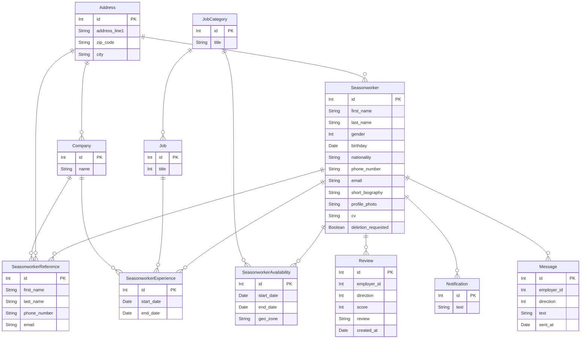

# Analysis Document - LinkedOut

LinkedOut is a user-friendly platform tailored to seasonal workers on the hunt for job opportunities.

This platform offers a variety of essential features, including user profile management, job listing services, intelligent job recommendations, streamlined recruitment processes, transparent review and rating systems, and multilingual support (initially in French and English).

## Terminology

### Actors

- User: A person using the platform that is not yet registered.
- Seasonal worker: A person looking for a job for a season.
- Employer: A person looking for a seasonal worker.
- Administrator: A person managing the platform.

### Glossary

- Reference: A person who can recommend a seasonal worker.

## User stories

### Authentication and account

- As a user, I want to create a seasonal worker account.
- As a user, I want to be able to log in.
- As a seasonal worker, I want to be able to view my account information.
- As a seasonal worker, I want to be able to update my account information.
- As a seasonal worker, I want to be able to request the deletion of my account.
- As an administrator, I want to be able to confirm the deletion request of a seasonal worker.

### Profile

- As a seasonal worker, I want to be able to add references (people who can recommend me).
- As a seasonal worker, I want to be able to view my references.
- As a seasonal worker, I want to be able to modify my references.
- As a seasonal worker, I want to be able to delete my references.
- As a seasonal worker, I want to be able to add professional experiences.
- As a seasonal worker, I want to be able to view my professional experiences.
- As a seasonal worker, I want to be able to modify my professional experiences.
- As a seasonal worker, I want to be able to delete my professional experiences.
- As a seasonal worker, I want to be able to add availabilities.
- As a seasonal worker, I want to be able to view my availabilities.
- As a seasonal worker, I want to be able to modify my availabilities.
- As a seasonal worker, I want to be able to delete my availabilities.

### Review

- As a seasonal worker, I want to be able to view the scores and reviews given to me by employers.
- As a seasonal worker, I want to be able to give a score and review to an employer.
- As a seasonal worker, I want to be able to view the scores and reviews I have given to employers.
- As a seasonal worker, I want to be able to modify a score and review I have given to an employer.
- As a seasonal worker, I want to be able to delete a score and review I have given to an employer.
- As an employer, I want to be able to give a score and review to a seasonal worker.
- As an employer, I want to be able to view the scores and reviews of a seasonal worker.
- As an employer, I want to be able to modify a score and review I have given to a seasonal worker.
- As an employer, I want to be able to delete a score and review I have given to a seasonal worker.

### Job listing

- As a seasonal worker, I want to be able to view all job listings.
- As a seasonal worker, I want to be able to view job listings sorted by relevance.
- As a seasonal worker, I want to be able to receive a notification whenever a new job listing is posted.

### Job application

- As a seasonal worker, I want to be able to apply to a job listing.
- As a seasonal worker, I want to be able to view the job listings to which I have applied.
- As a seasonal worker, I want to be able to know if the employer has accepted or rejected my application to a job listing.
- As a seasonal worker, I want to be able to receive a notification whenever the state of my application changes.
- As an employer, I want to be able to create a new job listing.
- As an employer, I want to be able to view the list of seasonal workers who have applied to my job listing.
- As an employer, I want to be able to accept or reject the application of a seasonal worker to my job listing.

### Messaging

- As a seasonal worker, I want to be able to send a message to an employer.
- As a seasonal worker, I want to be able to view the messages I have sent to and received from an employer.
- As a seasonal worker, I want to be able to initiate a video call with an employer through an external service.
- As an employer, I want to be able to send a message to a seasonal worker.
- As an employer, I want to be able to view the messages I have sent to and received from a seasonal worker.

### Administration

- As an administrator, I want to be able to access a private page to manage the service.

## Database

Arrows signification:

| Value (left) | Value (right) | Meaning                       |
| ------------ | ------------- | ----------------------------- |
| `\|o`        | `o\|`         | Zero or one                   |
| `\|\|`       | `\|\|`        | Exactly one                   |
| `\}o`        | `o\{`         | Zero or more (no upper limit) |
| `\}\|`       | `\|\{`        | One or more (no upper limit)  |

### `Seasonworker`

This table stores the information about a seasonal worker. 

It is linked to:
- The `Address` table to store the personal address of the seasonal worker.

| Column name          | Type    | Description                                                                                                                                                  |
| -------------------- | ------- | ------------------------------------------------------------------------------------------------------------------------------------------------------------ |
| `id`                 | Integer | Unique identifier of the seasonal worker.                                                                                                                    |
| `first_name`         | String  | First name of the seasonal worker.                                                                                                                           |
| `last_name`          | String  | Last name of the seasonal worker.                                                                                                                            |
| `gender`             | Integer | Gender of the seasonal worker. Valid values are `0` (Not known), `1` (Male), `2` (Female) and `9` (Not applicable), following the "ISO/IEC 5218" standard.   |
| `birthday`           | Date    | Birthday of the seasonal worker.                                                                                                                             |
| `nationality`        | String  | Nationality of the seasonal worker, following the "ISO 3166-1 alpha-3" standard.                                                                             |
| `phone_number`       | String  | Phone number of the seasonal worker.                                                                                                                         |
| `email`              | String  | Email address of the seasonal worker.                                                                                                                        |
| `short_biography`    | String  | Short biography of the seasonal worker.                                                                                                                      |
| `profile_photo`      | String  | Path to the profile photo of the seasonal worker.                                                                                                            |
| `cv`                 | String  | Path to the CV of the seasonal worker.                                                                                                                       |
| `deletion_requested` | Boolean | Whether the seasonal worker has requested the deletion of their account.                                                                                     |

### `SeasonworkerReference`

This table stores the information about the references (people who can recommend a seasonal worker) of a seasonal worker.

It is linked to:
- The `Address` table to store the personal address of the reference.
- The `Seasonworker` table to store the seasonal worker who added the reference.
- The `Company` table to store the company in which the reference works.

| Column name     | Type    | Description                                                                                   |
| --------------- | ------- | --------------------------------------------------------------------------------------------- |
| `id`            | Integer | Unique identifier of the reference.                                                           |
| `first_name`    | String  | First name of the reference.                                                                  |
| `last_name`     | String  | Last name of the reference.                                                                   |
| `phone_number`  | String  | Phone number of the reference.                                                                |
| `email`         | String  | Email address of the reference.                                                               |

### `SeasonworkerExperience`

This table stores the information about the professional experiences of a seasonal worker.

It is linked to:
- The `Job` table to store the job of the experience.
- The `Seasonworker` table to store the seasonal worker who added the experience.
- The `Company` table to store the company in which the experience was acquired.

| Column name   | Type    | Description                                                                                   |
| ------------- | ------- | --------------------------------------------------------------------------------------------- |
| `id`          | Integer | Unique identifier of the experience.                                                          |
| `start_date`  | Date    | Start date of the experience.                                                                 |
| `end_date`    | Date    | End date of the experience.                                                                   |

### `SeasonworkerAvailability`

This table stores the information about the availabilities of a seasonal worker.

It is linked to:
- The `JobCategory` table to store the job category in which the seasonal worker is available.
- The `Seasonworker` table to store the seasonal worker who added the availability.

| Column name   | Type    | Description                                                                                   |
| ------------- | ------- | --------------------------------------------------------------------------------------------- |
| `id`          | Integer | Unique identifier of the availability.                                                        |
| `start_date`  | Date    | Start date of the availability.                                                               |
| `end_date`    | Date    | End date of the availability.                                                                 |
| `geo_zone`    | String  | Geographical zone in which the seasonal worker is available.                                  |

### `Notification`

This table stores the notifications received by a seasonal worker.

It is linked to:
- The `Seasonworker` table to store the seasonal worker who received the notification.

| Column name   | Type    | Description                                                                                   |
| ------------- | ------- | --------------------------------------------------------------------------------------------- |
| `id`          | Integer | Unique identifier of the notification.                                                        |
| `text`        | String  | Text of the notification.                                                                     |

### `Message`

This table stores the messages sent between a seasonal worker and an employer.

It is linked to:
- The `Seasonworker` table to store the seasonal worker who sent/received the message.

| Column name   | Type    | Description                                                                                                         |
| ------------- | ------- | ------------------------------------------------------------------------------------------------------------------- |
| `id`          | Integer | Unique identifier of the message.                                                                                   |
| `employer_id` | Integer | Unique identifier of the employer who sent/received the message.                                                    |
| `direction`   | Integer | Direction of the message. Valid values are `0` (Seasonal worker => Employer) and `1` (Employer => Seasonal worker). |
| `text`        | String  | Contents of the message.                                                                                            |
| `sent_at`     | Date    | Date at which the message was sent.                                                                                 |

### `Review`

This table stores the reviews and ratings given between a seasonal worker and an employer.

It is linked to:
- The `Seasonworker` table to store the seasonal worker who gave/received the review.

| Column name   | Type    | Description                                                                                                             |
| ------------- | ------- | ----------------------------------------------------------------------------------------------------------------------- |
| `id`          | Integer | Unique identifier of the review.                                                                                        |
| `employer_id` | Integer | Unique identifier of the employer who gave/received the review.                                                         |
| `direction`   | Integer | Direction of the review. Valid values are `0` (Seasonal worker => Employer) and `1` (Employer => Seasonal worker).      |
| `score`       | Integer | Score given in the review. Valid values are `1` (Very bad), `2` (Bad), `3` (Neutral), `4` (Good) and `5` (Very good).   |
| `review`      | String  | Contents of the review.                                                                                                 |
| `created_at`  | Date    | Date at which the review was created.                                                                                   |

### `JobCategory`

This table stores the job categories.

| Column name   | Type    | Description                                                                                                             |
| ------------- | ------- | ----------------------------------------------------------------------------------------------------------------------- |
| `id`          | Integer | Unique identifier of the job category.                                                                                  |
| `title`       | String  | Title of the job category.                                                                                              |

### `Job`

This table stores the jobs.

It is linked to:
- The `JobCategory` table to store the category of the job.

| Column name   | Type    | Description                                                                                                             |
| ------------- | ------- | ----------------------------------------------------------------------------------------------------------------------- |
| `id`          | Integer | Unique identifier of the job.                                                                                           |
| `title`       | String  | Title of the job.                                                                                                       |

### `Company`

This table stores the companies.

It is linked to:
- The `Address` table to store the address of the company.

| Column name   | Type    | Description                                                                                                             |
| ------------- | ------- | ----------------------------------------------------------------------------------------------------------------------- |
| `id`          | Integer | Unique identifier of the company.                                                                                       |
| `name`        | String  | Name of the company.                                                                                                    |

### `Address`

This table stores addresses.

| Column name       | Type    | Description                                                                                                             |
| ----------------- | ------- | ----------------------------------------------------------------------------------------------------------------------- |
| `id`              | Integer | Unique identifier of the address.                                                                                       |
| `address_line1`   | String  | First line of the address.                                                                                              |
| `zip_code`        | String  | ZIP code of the address.                                                                                                |
| `city`            | String  | City of the address.                                                                                                    |

## Modules

### Authentication and account

The authentication, role and account management will be handled by Keycloak.

Keycloak is the OpenID Connect identity provider that will be used to authenticate users, register new users, and help them recover their password. Each user will be linked to a seasonal worker and they may also have an administrator role to manage the platform.

### Seasonworker profile 

- Manage seasonal worker profiles.
- Add, view, modify, and delete references, experiences, and availabilities.
- Only the seasonal worker can view and modify their profile.
- Employers can view the profile of a seasonal worker depending on their subscription.

### Job 

- Display and apply job listings.
- Any seasonal worker can view all, sort by relevance, and receive notifications for new listings.
- Create and manage job listings (employers).
- Employers can view and accept/refuse applicants.
- Only the seasonal worker can view the status of their application.
- This module is an external service that will be integrated into the platform.

### Job recommendation

- Recommend jobs to seasonal workers based on their profile.
- This uses the seasonal worker profile and job listing modules to recommend jobs to seasonal workers.

### Review and rating 

- Manage review and rating system.
- View and give reviews and ratings for seasonal workers and employers.

### Messaging 

- Send/receive messages between seasonal workers and employers.

### Notification 

- Handle system notifications.
- Notify seasonal worker about job application changes and new listings.

### Administration

- Manage the platform.
- For now, only the deletion of seasonal worker accounts is planned.
- Only users with the administrator role can access this module.