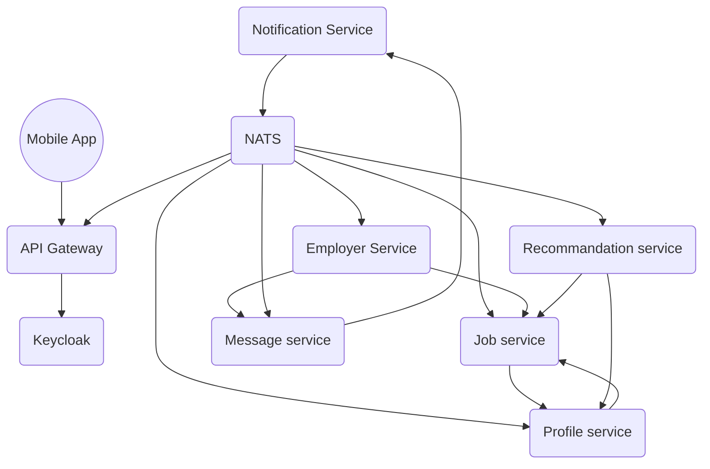

# Architecture document
The goal of this document is to provide a clear overview of our micro service infrastructure, explain our choices and provide a clear OpenAPI definition.

## Services

### `API Gateway`

The API Gateway is a single entry point for all clients. It is responsible for authentication and authorization of the clients. It also provides a single endpoint for all services. The API Gateway is implemented using [Spring Cloud Gateway](https://spring.io/projects/spring-cloud-gateway). This service works closely with the Keycloak service.

### `Keycloak`

[Keycloak](https://www.keycloak.org/) is an open source identity and access management solution. It will allow us to provide a secure authentication and authorization service for the client. We decided to use keycloak instead of another service like to acquire more experience on it since it is becoming one of the market leader.

### `Notification Service`

The Notification Service is responsible for sending notifications to the users. The goal is to have a single service responsible for sending notifications to the users.

### `Job offer service`

The Job offer service is responsible for managing jobs, job offers and companies. This service is implemented in kotlin using spring r2dbc as a reactive database driver. The service uses a postgres database. 

### `Employer Service`

The employer service represents the external software that employers uses to manage their job offers. LinkedOut calls to this external software for retrieving job offers, or giving evaluations to employers for instance. On the other hand, this external software calls to LinkedOut when an employer wants to message a seasonal worker, or to give an evaluation to a seasonal worker for instance. Since the employer service is an external service we will not have to implement it.

### `Profile service`

The Profile service is responsible for managing the profiles of the users. This profile will be written using Kotlin and graddle as a matter of uniformity with the others service. Profiles will be stored using a Postresql database.

### `NATS`
NATS is a "message oriented middleware" it allows services to exchange data easily. NATS allows us to build a distributed and scalable infrastructure by using dynamic discovery. This will allow us to manage replicasets of services easily since NATS will act as a. This will allow us to manage replicasets of services easily since NATS will act as a loadbalancer and distribute the requests to it's known services. We chose this solution instead of kafka for it's lightweight design, low latency and overall simplicity.

### `Message service`
The message service is here to manage communications between seasonal workers and employers, allowing them to tchat using an instant messagery. This service will have persistent storage provided by a Postgresql database.
 
### `Recommandation service`
The recommandation service is used to recommand job offers to seasonal workers. It will have a read access to the job and profile services and replicate the data in a graph database to find connexion between items and easily match jobs and workers.

## OpenAPI

We decided to create an OpenAPI document including every route accessible for the frontend app to normalize our interfaces and make the whole process easier.
The document is available [here]("./openapi/api_gateway.yml").
 

