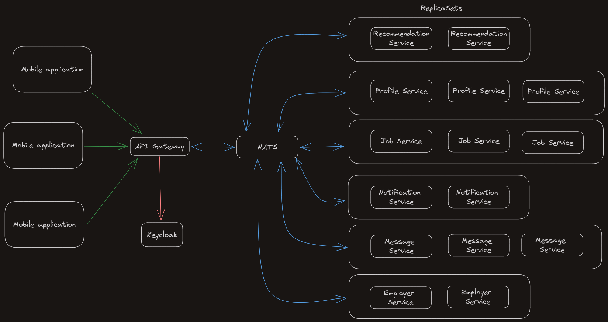

# LinkedOut Architecture
The goal of this document is to provide a clear overview of our microservice infrastructure, explain our choices and provide a clear OpenAPI definition.

## Technologies

### Kubernetes

Our production architecture leverages Kubernetes for container orchestration with Docker as the containerization platform. 
This powerful combination provides scalability, flexibility, and efficient management of containerized applications.

### Docker

We mianly use docker for development with many docker-composes to repliate the micro services and their databases but as said before we 
also use Docker as the containerization platform in our kubernetes environment

### NATS

We chose this solution instead of Kafka for its lightweight design, low latency and overall simplicity. 

It also has a built-in mechanism for doing synchronous request-reply messaging, which will be very useful for communication between the API gateway and the microservices. 

### Kotlin

We chose Kotlin as our main language for the backend because we wanted to learn a new language that could work in the same environment that Java does.

### Spring

Our backend uses Spring as the framework for building our microservices.

Spring Boot simplifies the development process, enhances productivity, and provides a solid foundation for microservices. 

### React Native and Expo

As for the frontend, we are using React Native to build a mobile application, which will be the primary way of interacting with LinkedOut.

We are also using Expo, which is a framework that brings build tools and rapid development for React Native-based application by providing features such as hot reload, and the generation of package files for Android and iOS. It also abstracts and exposes the services that the mobile operating system provides to the applications.

### GitHub

We use GitHub as our code host and collaboration platform since we both use it on a daily basis, and we know it the most.

We will also use the CI integrated in GitHub for our CI/CD pipelines, and use its GitHub Actions to simplify this process.

### Keycloak

[Keycloak](https://www.keycloak.org/) is an open source identity and access management solution. 

It is used to provide a secure authentication and authorization experience for the users. 

We decided to use Keycloak instead of another service like Zitadel or Auth0 to acquire more experience on it since it is one of the most popular identity providers.

### NATS vs Kafka

#### NATS:

**Pros:**
- Low latency, designed for real-time messaging.
- Lightweight protocol minimizes overhead.
- Horizontal scalability with clustering support.
- Fault-tolerant, resilient in challenging network conditions.
- Well-suited for distributed systems.

**Cons:**
- Smaller community compared to Kafka.
- Limited features for complex event processing.
- May not be as feature-rich as Kafka for large-scale systems.

#### Kafka:

**Pros:**
- Robust and scalable for large-scale data streaming.
- Durable, fault-tolerant, and high-throughput.
- Rich ecosystem with strong community support.
- Comprehensive features for event sourcing and complex processing.
- Well-established in big data and enterprise environments.

**Cons:**
- Requires additional resources for setup and maintenance.
- Higher learning curve due to its feature richness.
- Overhead may be unnecessary for smaller-scale projects.

### Java vs Kotlin

#### Java:

**Pros:**
- Widespread adoption and community support.
- Mature ecosystem with extensive libraries and frameworks.
- Platform independence through the Java Virtual Machine (JVM).
- Strong static typing for early error detection.
- Long-standing presence in enterprise development.

**Cons:**
- Verbosity in code, requiring more boilerplate.
- Slower adoption of modern language features.
- Null pointer exceptions can be a challenge.

#### Kotlin:

**Pros:**
- Concise syntax reduces boilerplate code.
- Modern language features, including null safety.
- 100% interoperability with Java, easing migration.
- Enhanced developer productivity.
- Officially supported by JetBrains.

**Cons:**
- Smaller community compared to Java.
- Learning curve for developers transitioning from Java.
- Limited presence in legacy systems.

### Github vs Gitlab

#### GitHub:

**Pros:**
- Large community and ecosystem.
- User-friendly interface.
- Robust documentation.
- Powerful collaboration features.
- GitHub Actions for CI/CD.

**Cons:**
- Charges for private repositories.
- Limited built-in CI/CD features.
- Dependency on Microsoft.

#### GitLab:

**Pros:**
- Integrated CI/CD.
- Free private repositories.
- Comprehensive DevOps platform.
- Flexible deployment options.
- Built-in container registry.

**Cons:**
- Learning curve for the interface.
- Smaller community compared to GitHub.
- Extensive feature set may overwhelm for simpler projects.

### Keycloak vs Zitadel vs Auth0

#### Keycloak
**Pros:**
- Open source
- Widely use with a strong community
- Wide range of features

**Cons**
- Complexity, when first trying keycloak it can be kind of complex to understand it's role and implications
- Redhat documentation, keycloak documentation might be very hard to get through at some points due to it's documentation.

#### Zitadel
**Pros**
- User-Centric Approach: Zitadel is designed with a strong focus on user experience and user-centric identity management.
- Strong Security Features: Zitadel emphasizes security and includes features such as passwordless authentication and zero-trust architecture.
- Enterprise-Grade: Zitadel positions itself as an enterprise-grade solution, catering to the needs of larger organizations.

**Cons**
- Lesser Adoption: As of my last knowledge update in January 2022, Zitadel might have had fewer users and 
community support compared to more established solutions like Keycloak or Auth0.
- Pricing: While Zitadel offers a free tier, pricing for larger enterprises might be a consideration.

#### Auth0
**Pros**
- Ease of Use: Auth0 is known for its ease of use and quick setup. It provides a user-friendly dashboard and supports various identity scenarios out of the box.
- Large User Base: Auth0 is widely adopted and has a large user base, leading to a robust community and extensive third-party integrations.
- Extensive Documentation: Auth0 provides thorough and well-organized documentation, making it easier for developers to implement and troubleshoot.

**Cons**
- Pricing: Auth0's pricing might be higher compared to some other solutions, especially for large enterprises with high user counts.
- Limited Customization in Free Tier: Some advanced features and customization options may be restricted in the free tier.

## Services

### API Gateway

The API Gateway is a single entry point for all clients. 
It provides HTTP endpoints to access the different services in the infrastructures, and does so while checking the authorization claims of the user doing the request. 
This service works closely with the Keycloak service.

### Notification Service

The Notification Service is responsible for sending notifications to the users. The goal is to have a single service responsible for sending notifications to the users.

### Job Service

The Job Service is responsible for managing jobs, job categories, job offers and companies. This service is implemented in Kotlin using Spring R2DBC as a reactive database driver. 

We chose R2DBC instead of JPA because we need to have asynchronous requests in our architecture to optimize latency. 
Having a synchronous system would mean we could only treat one request at a time which, at larger scale, would not be efficient enough.

The service uses a Postgres database to store its data.

### Employer Service

The Employer Service represents the external software that employers uses to manage their job offers. 

LinkedOut calls to this external software for retrieving job offers, or giving evaluations to employers for instance. 
On the other hand, this external software calls to LinkedOut when an employer wants to message a seasonal worker, or to give an evaluation to a seasonal worker for instance.

Since the employer service is normally an external service, we will only implement something that mocks it.

### Profile Service

The Profile Service is responsible for managing the profiles of the users.

Profiles will be stored in a Postgres database and also uses R2DBC as its database driver.

### NATS

NATS is a "Message-oriented Middleware": it allows services to communicate with each other easily. 

NATS is the central element in our distributed and scalable infrastructure because it provides dynamic discovery and a message broker. 

This will allow us to manage replica sets of services easily since NATS will abstract the concrete connection to the service using its 
mechanism of "subjects" (which are like Kafka's topics) and will load balance messages between all consumers subscribed to a subject in particular. 

### Message Service

The Message Service is here to manage communications between seasonal workers and employers, allowing them to chat using instant messaging. 

This service will have persistent storage provided by a Postgres database.
 
### Recommendation Service

The Recommendation Service is used to recommend job offers to seasonal workers. 

It will have read access to the job and profile services and replicate the data in a graph database (such as Neo4j) to find connections between related items and provide scores on the job offers for a seasonal worker.

## OpenAPI

We decided to create an OpenAPI specification document that documents every route accessible from the API gateway for the mobile application to normalize our interfaces and make the whole process easier by allowing us to architecture our API early and implement a mock server for it.

The document is available [here](./openapi/api_gateway.yml). 

