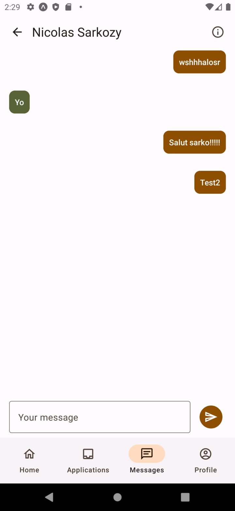

# LinkedOut

## Introduction

LinkedOut is a user-friendly platform tailored to seasonal workers on the hunt for job opportunities.

This platform offers a variety of essential features, including user profile management, job listing services, intelligent job recommendations, streamlined recruitment processes, transparent review and rating systems, and multilingual support (initially in French and English).

## Microservices

One of the main goal of this project was to learn how to create and manage a microservice architecture.

A microservice architecture offers independent scaling of components, allowing each part to adapt to its resource needs and load patterns.
This promotes flexibility and agility by decoupling different parts of the system, facilitating faster iteration and feature releases.

Furthermore, microservices enable the use of diverse technologies and programming languages within a single application. In our case, we only used Kotlin, but we could have used different languages for each service, as long as they all "speak the same language" when communicating with each other.

Failures are easier to handle since services are isolated, reducing the risk of cascading failures across the system. They enhance resilience and availability through redundancy and distributed architectures.

Microservices also facilitate easier maintenance and evolution of complex systems due to well-defined scopes and responsibilities.

Lastly, they support DevOps practices such as continuous integration, continuous delivery, and automation, fostering a more efficient development and deployment process.

It was a bit hard to get started but once we understood the basics, it was really easy to work with microservices since it is very repetitive.

### API Gateway

The API Gateway serves as the entry point for client requests into the microservices architecture, acting as a central interface for managing and routing HTTP requests. It plays a pivotal role in handling communication between clients and the underlying microservices.

In handling HTTP requests, the API Gateway acts as a reverse proxy, receiving incoming requests from clients and forwarding them to the appropriate microservices based on predefined routing rules. It abstracts the complexity of the underlying microservices architecture, presenting clients with a unified interface while allowing backend services to evolve independently.

Moreover, the API Gateway can leverage NATS (a lightweight and high-performance messaging system) to facilitate inter-service communication. When a client request requires interaction with multiple microservices, the API Gateway can publish messages to NATS topics, allowing interested microservices to subscribe and respond accordingly. This asynchronous messaging pattern enhances scalability and resilience within the microservices ecosystem. For example if a microservice is down, the message will be stored in the NATS server and the microservice will be able to process it once it is back up. That process is called event sourcing.

At the beginning of the project we decided to use the OpenAPI specification to define the API Gateway's RESTful API.
This allowed us to define the API's structure, enabling us to have a common view of what the backend will have to look like. Looking back, it was a good decision since it allowed us to have a clear view of what we had to do, and it also allowed us to write a mock server to test the front end using [json-server](https://www.npmjs.com/package/json-server). That allowed us to work on the front-end and the back-end at the same time without having to wait for the other to be done.
To explore the OpenAPI documentation for the HTTP API exposed by the API Gateway, you can access the following link: [API Gateway OpenAPI Specification](openapi/api_gateway.yml)

### NATS

NATS is a lightweight and high-performance messaging system that facilitates communication between microservices within a distributed architecture. It serves as a central messaging backbone, enabling efficient and reliable message delivery across different components of the system.

In essence, NATS functions as a publish-subscribe messaging system, where producers publish messages to subjects (topics), and consumers subscribe to specific subjects to receive messages. This decouples the producers and consumers, allowing for asynchronous communication and reducing dependencies between microservices.

Within a microservices architecture, NATS is used to enable inter-service communication. When one microservice needs to communicate with another, it can publish messages to relevant NATS subjects, indicating the intent or action required. Subsequently, other microservices that are interested in the message content can subscribe to the appropriate subjects and react accordingly.

To optimize message transmission and ensure compatibility between microservices, we chose [Protocol Buffers](https://protobuf.dev/) (protobuf) to define the structure and serialization format of messages exchanged via NATS. Protobuf allows for the definition of message schemas in a language-neutral format, facilitating communication between services implemented in different programming languages. We split the messages into smaller, granular units based on business logic and functional requirements.

- There are [models](./backend/protobuf/src/main/proto/models/), which represent basic objects holding data like an `experience`, a `jobOffer`, a `profile`...
- We also have [DTOs](./backend/protobuf/src/main/proto/dto/) which are Data Transfer Objects. Those are used as the parameters of the request to services, and can use the models.
- Then for each microservice, there is an associated [service](./backend/protobuf/src/main/proto/services/) which represent the service's API. In each of the service files, there is a pair of request/response message definition that contains the data that is transferred back and forth. Those definitions can use models and usually use DTOs.
- Finally, each of the request and response messages of the services are then grouped together in two unions: [request](./backend/protobuf/src/main/proto/request.proto) and [response](./backend/protobuf/src/main/proto/response.proto).

By using protobuf, messages can be efficiently serialized and deserialized, reducing message size and network overhead, because they are directly transformed to and from a binary format, instead of a more verbose format such as JSON. Additionally, protobuf schemas help in maintaining compatibility between different versions of microservices by allowing for backward and forward compatibility through the addition or modification of message fields.

To further enhance scalability and performance, messages are typically split into smaller, granular units based on business logic and functional requirements. This practice helps in reducing message complexity, improving parallel processing, and enabling fine-grained control over message routing and processing within the microservices architecture.

Overall, NATS, in conjunction with protobuf, plays a crucial role in facilitating seamless communication and interaction between microservices, enabling the development of scalable, resilient, and loosely coupled distributed systems.

### Keycloak authentication

[Keycloak](https://www.keycloak.org/) serves as our Identity and Access Management solution, enabling user authentication and authorization within our microservices architecture.

The authentication flow begins when a user attempts to access protected resources within our system. The client application forwards the user's credentials (e.g., username and password) to the Keycloak authentication server for verification.

Once Keycloak verifies the user's credentials, it issues a JSON Web Token (JWT) containing authentication and authorization information. This JWT is then sent back to the client application.

Within our microservices architecture, we have implemented a centralized authentication mechanism using Keycloak and the API Gateway. The API Gateway intercepts incoming requests from clients and checks the signature of the JWT provided in the request headers against the Keycloak server to ensure the user's authentication and authorization status. If the JWT is valid and its signature is verified, the API Gateway forwards the request to the appropriate microservice for further processing, trusting its content (the most important being the user ID).

We decided to only check the token in the gateway and not in each microservice to avoid the overhead of checking the token for each request in each microservice used. We could have done a zero-trust architecture where each microservice would check the token, but we decided to go with the centralized approach. Such a zero-trust architecture would be more appropriate for a more complex project that would have more resources for its development, as it is intrinsically more secure but also more complex to implement efficiently.

Our Keycloak configuration is stored in the [linkedout_realm.json](./config/keycloak/linkedout_realm.json) file, which contains the roles and the clients we use already inside a realm. This config is then imported in the Keycloak server and saves us a lot of time since we don't have to create the roles and the clients manually.

### Profile Service

The Profile Service is responsible for managing user profiles within the LinkedOut platform. It handles the creation, retrieval, and modification of user profiles, as well as the management of user experiences, evaluation, and availability.

This service also has to contact the recommendation service whenever a new user is created to store a Neo4j node with their UUID to then later recommend special job offers for this user.

### Job Service

The Job Service is responsible for managing job offers within the LinkedOut platform. It does not handle the creating of jobs and job offers since it was specified that the "employer service" was responsible for that. It handles the retrieval of job offers, jobs and job categories, the creation of job applications, and the management of job applications and job offers.

This service also has to contact the recommendation service to retrieve custom job offers for a user. We used Flyway migration to keep the database up to date and store some immutable information like job categories and jobs as well as some job offers since we don't have any routes to create those.

### Message Service

The Message Service is responsible for managing messages and message channels within the LinkedOut platform. It handles the creation and retrieval of messages and message channels. By doing so, it allows the user to communicate with employers and directly exchange messages with them.

A message channel is a single message room that is shared between a seasonal worker and an employer. It contains the list of messages that were exchanged between both. They can be created by the seasonal worker whenever they want to initiate a conversation with an employer who accepted their job application.

### Notification Service

The Notification Service is responsible for managing notifications within the LinkedOut platform. It handles the creation and retrieval of notifications. By doing so, it allows the user to receive notifications from the platform.

### Recommendation Service

The Recommendation Service is responsible for providing personalized job recommendations to users based on their profiles and experiences. It leverages a graph database (Neo4j) to store and manage user profiles, experiences, and job offers, and uses graph-based algorithms to generate recommendations.

Like in the job service, we populate the database with the job categories, job offers and jobs. To do so, we use a [Cypher script](./backend/recommendation/) and a Neo4j plugin named APOC (Awesome Procedures On Cypher), which provides a set of procedures and functions to enhance the capabilities of Neo4j.

In the picture above, you can see the graph database after initialization: in red there's each job node, in yellow each job category node and in blue each job offer node.

When a new user profile is created, the Recommendation Service stores the user profile as a new node in the Neo4j graph database containing only its ID. Same thing when a new experience is created: we create a new node with the experience ID and link it to both a user node and a job.

By doing so we have a graph of users, experiences, jobs and job offers. We then use the Neo4j driver to retrieve the recommendations. We use the graph database to find the shortest path between the user and the job offer. Finally, we return a list of job offers IDs. This list of job offers IDs is then used to retrieve the job offers from the job service. If there is no job offers to return, the job service will return all the job offers in the database.

In the picture above you can see the graph database after we created a new user (the green node) with multiple experiences (the pink nodes).

## Kubernetes deployment

We chose to deploy our microservices architecture on a Kubernetes cluster to take advantage of its container orchestration capabilities, scalability, and resilience and to improve our understanding of this tool. The production environment is deployed on a k3s cluster hosted on a Proxmox virtual machine at Polytech. We used Kustomize to manage the configuration of the different services and to make the deployment easier.

## Mobile App

We also developed a mobile app to interact with the platform. The app is in written in React Native with the Expo framework making it available for both Android and iOS. The app features few interesting things such as an English and French version, a dark mode and a light mode. It is made of this main screens:

### Login and Register

When the user opens the app for the first time, they are greeted with a Keycloak login screen. If they don't have an account, they can click on the "Register" button to create a new account. After the user logs in, the app will store the token in the device's storage and use it to authenticate the user in the future.

### Job Offers

Displays the job offers. The user can apply get more information about the offer by clicking on it. They can also apply to the job offer by clicking on the "Apply" button. By default, the backend will send every job offers to the app if the user doesn't have any experience yet but if they do, the backend will send only the job offers that are recommended for the user using the recommendation service.

  
   
  Home page (list of available job offers)

### The list of applied jobs

Whenever the user applies to a job offer, the job offer is added to the list of applied jobs. The user can click on the job offer to get more information about it. This list is very useful for the user to keep track of the job offers they applied to and their current status.

  
   
  Applied jobs

 

  
   
  Details of a job offer

### Messages and Notifications

The user can see their messages and notifications, both being split in two different tabs available at the top of the screen. The messages are sent by the employer to the user and the notifications are sent by the app to the user. The user can click on a message to enter the message channel between him and an employer and can click on a notification to get more information about it.

  
   
  Notifications

 

  
   
  Conversations

 

  
   
  Messages with an employer

### Profile

Displays the user's profile. The user can edit their profile, add experiences availabilities as well as references. To do so we decided to go for a main profile screen with an edit button to edit the profile and a button to add experiences, availabilities and references. Each category has its own screen with both the information view and the edit view.
The profile screen provides comprehensive details including the user's email address, biography, phone number, address, list of experiences, availabilities, and references.

  
   
  Profile

 

  
   
  Experiences

 

  
   
  Updating experiences

 

  
   
  Editing an experience

## Postmortem and conclusion

Overall, the project was a success. We learned a lot about microservices, Kubernetes, Keycloak, Neo4j, NATS, Protocol Buffers, and many other technologies. We also learned a lot about the importance of organization in general and how to prepare a project the right way by planning it.

Having a good view of the project before it starts is a key point. This is done by defining the OpenAPI specification, by creating detailed models of the application. Doing this allows us to enlighten all the potential dark spots of the projects and to make sure if we work in a team that we have a same definition of done for each feature.

Another good thing we did was to implement a mockup server to test the front-end and the back-end at the same time. This allowed us to work on the front-end and the back-end at the same time without having to wait for the other to be done. This was a good decision since it allowed us to work on the project faster and to have a better view of the project as a whole.
It also made the backend and frontend connection a lot easier since we already coded and tested most of the frontend accordingly to the backend's API.

During this project we have been able to split the work accordingly to our preferences and also made sure we both worked on different parts of the project to make sure we both learned as much as possible. Forcing ourselves to get out of our comfort allowed us to learn a lot more than we would have if we had worked on the same parts of the project.
